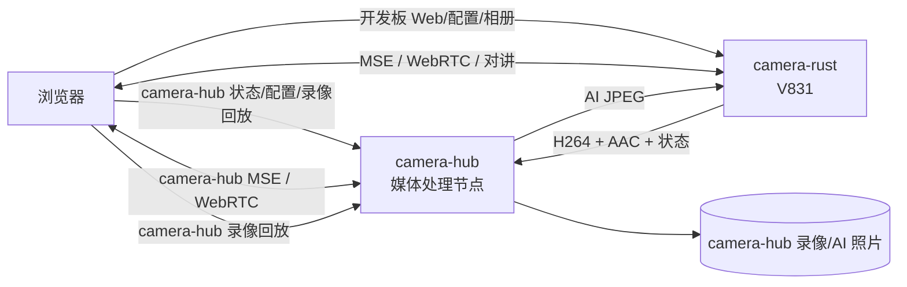

# Camera Rust - V831/M2Dock 监控服务

`camera-rust` 是最新 [camera](../camera) 的 Rust 迁移版本，保持相同的浏览器前端、
HTTP API、WebSocket 媒体协议、录像格式和板端目录布局。

## 设计边界

项目采用窄 FFI 的混合架构：

- Rust：进程生命周期、HTTP/HTTPS、WebSocket/WSS、有界广播队列、滚动录像、
  `.idx` 索引、Range 下载、强类型配置、系统信息、设备动作、MQTT、
  录像清理、VMD、Snapshot 调度/写盘、AI 触发策略、提示音 WAV 校验/解析、
  OPUS 对讲队列/worker、`webrtc-rs` 公网 IPv6 直连和 GPIO 补光灯。
- 原生媒体桥：V831 双摄像头/VO、Cedar H264、ALSA + FFmpeg AAC、
  FFmpeg fMP4、OpenCV JPEG/OSD、NPU 推理、同步 OPUS 解码和 PCM/ALSA 播放。

厂商结构体、FFmpeg/OpenSSL 内部类型和硬件指针不会进入 Rust 业务模块。
媒体 FFI 的 `unsafe` 集中在 `src/native.rs`；少量信号、网卡和 statvfs
系统调用分别留在对应 OS 边界，对外只提供安全方法。

## 功能

- cam0 640x480 NV21 显示、OSD 和 H264 硬编码
- cam1 224x224 RGB888 NPU 人形检测
- AAC-LC 48kHz 单声道采集与 fMP4 封装
- fMP4 over WS/WSS 直播，兼容 MSE 和 iOS ManagedMediaSource
- H264/Opus over WebRTC，浏览器与 camera 公网 IPv6 直接传输
- ADTS AAC 纯音频直播
- OPUS 浏览器对讲和 WAV 提示音
- 按天滚动 MP4 录像、`tfdt` 归零和 `.idx` 精准回放索引
- HTTP Range/206 流式回放与 JPEG 相册
- HTTP/HTTPS 配置中心、设备动作代理、系统信息
- VMD、AI 抓拍、MQTT IPv6 上报、PH13 补光灯
- 通过无 Token 双向 WebSocket 只向 camera-hub 上传 H264/AAC、同步设备状态并接收
  AI 图片，支持 `/64` IPv6 前缀跟随
- Camera-hub 托管的权威 IP TLS、日志 WebSocket、内存看门狗

## 目录

```text
camera-rust/
├── native/
│   ├── camera_native.h          # 稳定 C ABI
│   ├── camera_native.cpp        # V831/媒体原生桥
│   └── camera_native_stub.cpp   # macOS/Linux 主机测试 stub
├── src/
│   ├── main.rs                  # 生命周期、信号与启动顺序
│   ├── app.rs                   # 共享状态和媒体回调
│   ├── native.rs                # 安全 FFI 封装
│   ├── http.rs                  # HTTP/HTTPS、API、Range
│   ├── websocket.rs             # WS/WSS 和端点路由
│   ├── webrtc.rs                # UDP6 ICE、DTLS/SRTP 和 send-only Track
│   ├── hub.rs                   # 1 MiB/8 帧有界广播
│   ├── recorder.rs              # MP4 滚动录像和 idx
│   ├── cleaner.rs               # 保留天数和容量清理
│   ├── actions.rs               # 动作存储与出站 HTTP
│   ├── mqtt.rs                  # MQTT 3.1.1 QoS0 reporter
│   ├── light.rs                 # GPIO 补光灯
│   ├── motion.rs                # 80x60 Y 平面帧差 VMD
│   ├── snapshot.rs              # 抓帧、命名、写盘和淘汰
│   ├── person.rs                # AI 检测事件冷却和自动拍照
│   ├── remote_hub.rs            # camera-hub 单 WebSocket 媒体与状态链路
│   ├── prompt.rs                # 提示音路径、WAV 校验和 PCM 解析
│   ├── talk.rs                  # OPUS 有界队列、worker 和客户端生命周期
│   ├── netinfo.rs               # IPv4/IPv6 枚举
│   ├── config.rs                # 强类型配置、迁移与原子持久化
│   ├── sysinfo.rs               # procfs/statvfs
│   └── io.rs                    # 明文/TLS 统一 IO
├── build.rs                     # ARM 原生桥和动态库链接
├── start_app.sh
├── switch_camera.sh             # C++/Rust 原子切换
└── sync.sh
```

## 端口

| 端口 | 协议 | 用途 |
|---|---|---|
| 80 | HTTP | Web、REST API、录像/相册 |
| 443 | HTTPS | 80 的 TLS 镜像 |
| 8081 | WS | live/audio/talk/log |
| 8444 | WSS | 8081 的 TLS 镜像 |
| 8082 | WS | 兼容回放监听端口 |
| 8445 | WSS | 8082 的 TLS 镜像 |

HTTPS/WSS 优先读取共享运行状态目录：

```text
/root/maix_dist/state/tls/fullchain.pem
/root/maix_dist/state/tls/private.key
```

Camera-hub 在高性能节点上运行 ACME 客户端，为开发板当前公网 IPv6 申请 Let’s
Encrypt short-lived IP 证书，并通过 SSH 原子同步到该目录。Rust/C++ 两种版本共用
同一证书；证书变化后 Camera-hub 调用 `switch_camera.sh` 重启当前活动版本。
`cert/server.crt` 只保留为首次迁移前的自签名回退，不再由部署脚本覆盖。

开发板的 HTTP/80 提供：

```text
/.well-known/acme-challenge/<token>
```

内容来自 `state/acme-webroot/`，仅用于 HTTP-01 验证。ACME 客户端和私钥传输都不在
资源受限的 V831 进程内执行。

WebSocket 路径：

- `/`、`/ws/live`：fMP4 init segment + fragment
- `/ws/audio`：ADTS AAC
- `/ws/talk`：浏览器上传 OPUS
- `/ws/log`：UTF-8 日志二进制帧

WebRTC 信令 API：

- `POST /api/webrtc/offer`：浏览器提交 SDP offer，返回 SDP answer
- `GET /api/webrtc/status`：查询 `idle/negotiating/connecting/connected`
- `DELETE /api/webrtc/session`：关闭当前直连会话

WebRTC 仅发布 UDP6 host candidate，不经过 STUN、TURN 或 SFU。实况页浏览器只创建
`recvonly` 音视频 transceiver；只允许一个低延时观看会话，新 offer 会替换旧会话。

## camera-hub 分布式架构

开发板 Web 是主要管理入口。camera-hub 接收媒体并执行 ONNX AI，生成的图片经
同一设备 WebSocket 回传本地 `snapshot/`，因此仍在开发板相册统一查看。两端录像
均可独立开关。



功能归属：

| 功能 | 数据路径 | 执行位置 |
|---|---|---|
| camera-hub 状态、配置与录像回放 | 浏览器 → camera-hub | camera-hub |
| 拍照、补光灯、动作、开发板配置 | 浏览器 → camera-rust | V831 |
| 远端录像与 ONNX AI | camera-rust → camera-hub | camera-hub |
| 开发板 MSE/WebRTC/对讲 | 浏览器 ↔ camera-rust | 浏览器与 V831 直连 |
| camera-hub 流畅/低延时直播 | 浏览器 ↔ camera-hub | camera-hub 封装 fMP4 / 按需 AAC→Opus |

开发板连接配置：

| 字段 | 含义 |
|---|---|
| `camera_hub_url` | camera-hub 地址；推荐 `http://mi6.gwghome.site`，非空即连接上传 |
| `camera_hub_follow_board_prefix` | 仅用于 IPv6 字面量；使用 DDNS 域名时保持关闭 |
| `camera_hub_device_id` | camera-hub 上区分媒体、录像和照片的设备标识 |

camera-hub 的设备上传入口推荐使用 `http://mi6.gwghome.site/`。也可使用
`http://[hub-ipv6]/`；IPv6 字面量需要方括号，标准端口无需显式指定。

URL 非空时开发板持续建立主 WebSocket，断线后每秒重连。帧队列最多 512 项或
8 MiB，网络异常时丢最旧数据，不阻塞本地采集、直播和录像。camera-hub AI 与
远端录像只在 camera-hub Web 中配置。

`GET /api/camera-hub/status` 返回实际解析地址、连接状态、上传/丢帧/AI 图片回传计数和
最近错误。camera-hub 不提供 VMD；移动侦测由开发板本地配置和执行。

设备主链路为 `GET /api/v1/devices/:id/link` WebSocket。二进制 `CHP1` 消息承载
H264、AAC 和 AI JPEG；文本消息仅承载周期性 `hello` 状态。camera-hub 从 H264/AAC
零转码封装 fMP4，且只在 camera-hub WebRTC 会话存在时将 AAC 转为 Opus。该链路不携带
Device Token。

H264/AAC 上行使用 CHP1 v2：

```text
magic "CHP1" | kind u8 | version=2 | flags u16
sequence u32 | pts_us i64 | payload_length u32
capture_epoch_us i64 | payload
```

`capture_epoch_us` 在编码完成帧进入远端队列时取系统 UTC 微秒，用于 camera-hub
四协议评测的编码完成到浏览器实际渲染端到端延迟。AI JPEG 下行继续使用 CHP1 v1。
主 WebSocket 同时响应 camera-hub 的四时间戳双向校时请求，避免把板端到节点的
单向网络时延误当成系统时钟偏差。

AAC PTS 不再使用启动时固定锚点无限累加，而是根据 ALSA 最新采集完成时刻和 AAC
包对应的样本位置持续校准。这样可消除声卡采样时钟与视频单调时钟之间随运行时间
累积的漂移。

## 资源约束

V831 只有 64 MiB DDR，Rust 服务保留与 C++ 相同的保护：

- HTTP 最大 6 个并发客户端
- WebSocket 最大 8 个客户端
- HTTP header 16 KiB、body 1 MiB、绝对读取超时 10 秒
- WebSocket 客户端 payload 64 KiB
- 每个订阅者最多积压 8 帧或 1 MiB，超限丢最旧
- 对讲最多积压 64 帧或 256 KiB，超限丢最旧
- WebRTC 视频最多积压 4 帧、Opus 最多积压 16 帧
- 文件响应固定 64 KiB 流式缓冲
- 网络线程显式使用 192/256 KiB 栈，不采用 Rust 默认大线程栈

启动期使用 `BTreeMap` 而不是带随机种子的 `HashMap`。板端 Linux 4.9 +
musl 的 `/dev/urandom` 回退路径与 Rust 1.93 HashMap 初始化不兼容，会在进入
媒体桥前忙等。

## 构建

构建机要求：

- `/opt/toolchain-sunxi-musl/toolchain`
- Rust stable 和 `armv7-unknown-linux-musleabihf`
- 同仓库最新 `examples/camera`
- `https://github.com/gengwenguan/webrtc` 中固定的 `a91689c3` 提交

推荐直接执行：

```bash
cd examples/camera-rust
./sync.sh build
```

脚本会：

1. 同步 `camera-rust`、作为原生参考的 `camera`，以及固定 revision 的
   `webrtc-rs` 离线镜像（构建机无法直接访问 GitHub）
2. 运行 `camera/project.py build`
3. 使用 hard-float musl target 编译 Rust
4. 组装 `dist/camera_rust` 与 `dist/camera_cpp`
5. 复制 `lib/web/cert/prompt/mem_watchdog.sh`

手工构建环境：

```bash
source /root/.cargo/env
export LIBMAIX_SDK_PATH=/root/work/libmaix
export CAMERA_CPP_DIR=/root/work/libmaix/examples/camera
export CAMERA_BUILD_DIR=$CAMERA_CPP_DIR/build
export V831_TOOLCHAIN_PATH=/opt/toolchain-sunxi-musl/toolchain/bin
rustup target add armv7-unknown-linux-musleabihf
cargo build --release
```

产物必须是：

```text
ELF 32-bit LSB executable, ARM, EABI5, hard-float
interpreter /lib/ld-musl-armhf.so.1
```

## 部署

```bash
./sync.sh push   # 同步、构建、推送并启动
./sync.sh run    # 推送编译机上已有 dist
./sync.sh switch rust
./sync.sh switch cpp
./sync.sh status
./sync.sh log    # 查看板端 camera.log
./sync.sh clean  # 清理编译机 Rust target/dist
```

两版统一部署到 `/root/maix_dist`：

```text
camera_cpp / camera_rust        两个候选二进制
camera                          当前活动副本，进程名始终为 camera
active_variant                  rust 或 cpp
config.json / actions.json      两版共享
record/ / snapshot/             两版共享
camera.log                      当前运行日志
camera_cpp.log / camera_rust.log 上一次切换前保存的版本日志
```

切换脚本会先停止当前进程并等待独占设备释放，再原子替换活动二进制。
watchdog 和开机启动仍只操作名为 `camera` 的活动进程。

## 测试

主机单元测试：

```bash
cargo test --target aarch64-apple-darwin   # macOS
cargo test --target x86_64-unknown-linux-gnu
```

当前覆盖：

- WebSocket RFC Accept 与 masked frame
- 直播 init segment 顺序
- 慢客户端有界丢帧
- MP4 `tfdt` 按 track 归零
- HTTP Range 与路径穿越拦截
- 动作字段与 IPv4/IPv6 URL 解析
- MQTT CONNECT/PUBLISH 编码
- 跨天补光时段判断
- CHP1 v2 编码完成 UTC 帧头
- 录像日期清理规则
- 配置类型校验、clamp 和旧响度版本迁移
- VMD 下采样帧差与触发
- Snapshot 无请求快路径
- 提示音名称、WAV 格式和 PCM 解析
- 对讲队列帧数/字节上限和丢最旧策略

已在 V831 实机验证：

- HTTP/HTTPS API
- WS fMP4 首包 `ftyp`
- WSS ADTS 首包 `fff1`
- H264/AAC/fMP4 持续输出
- MP4 + `.idx` 持续增长
- 206 Range
- 抓拍、相册、配置和动作 CRUD
- IPv4/IPv6 系统信息
- 动作出站 HTTP
- MQTT CONNECT/CONNACK/PUBLISH
- GPIO237 未启用时保持低电平
- Rust VMD 帧回调与异步抓拍
- Rust 配置更新实时同步到原生 AAC/AI/Snapshot/OSD
- Rust 提示音 WAV 解析到原生同步 PCM/ALSA 播放
- Rust 对讲 worker 到同步 OPUS 解码/ALSA 播放，并在断开后释放声卡
- 公网 IPv6 WebRTC offer/answer、H264/Opus、DTLS/SRTP 和 MSE 切换
- camera-hub 单 WebSocket 帧上传、状态同步、AI JPEG 回传和断线重连
- C++/Rust 往返切换并共享配置、录像和照片

实测运行基线约为 `VmRSS 32 MiB / VmData 18 MiB`。
