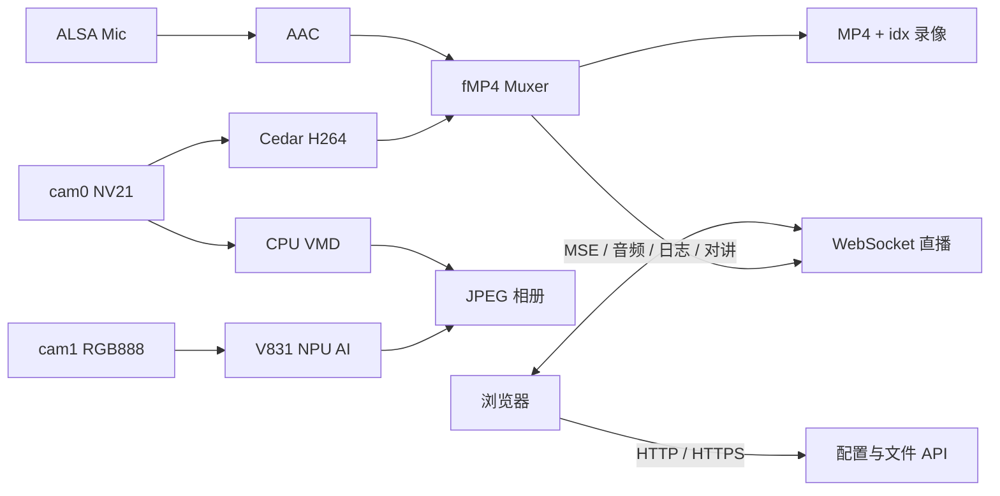

# Camera C++ - V831 / M2Dock 监控程序

这是 V831 开发板摄像头程序的 C++ 参考实现，负责采集、硬件编码、本地直播、
录像、AI/VMD 抓拍和硬件控制。

当前生产部署默认运行 [camera-rust](../camera-rust)，两版共用
`/root/maix_dist` 下的配置、录像、照片和 Web 资源，可随时切换对比。

## 快速开始

在 Mac 开发机执行：

```bash
cd examples/camera

./sync.sh build   # 同步到编译机并交叉编译
./sync.sh run     # 部署编译机上已有产物
./sync.sh push    # 重新编译、部署并启动
./sync.sh log     # 查看板端日志
```

双版本切换建议从 Rust 目录执行：

```bash
cd ../camera-rust
./sync.sh switch cpp
./sync.sh switch rust
./sync.sh status
```

浏览器访问：

```text
http://[board-ipv6]/
https://[board-ipv6]/
```

HTTPS/WSS 使用 Camera-hub 代管的 Let’s Encrypt short-lived IP 证书。证书保存在
共享运行状态目录，C++ 与 Rust 版本切换时不会覆盖：

```text
/root/maix_dist/state/tls/fullchain.pem
/root/maix_dist/state/tls/private.key
```

开发板只负责从 `state/acme-webroot/` 返回 HTTP-01 challenge；Camera-hub 负责申请、
续期并通过 SSH 原子下发证书。旧 `cert/server.crt` 是首次迁移回退，不是正式证书。

HTTPS 使用自签名证书，首次访问需要手动信任。

## 功能范围

- cam0：`640x480 NV21` 采集、屏幕显示、OSD 和 H264 硬件编码。
- cam1：`224x224 RGB888`，供 V831 NPU 人形检测使用。
- 麦克风：ALSA 采集，编码为 AAC 并封装进 fMP4。
- 直播：MSE/fMP4、纯音频和设备日志 WebSocket。
- 录像：按天、按分片写 MP4，并生成 `.idx` 精准回放索引。
- 相册：手动拍照、AI/VMD 自动抓拍、批量删除和下载。
- 硬件：补光灯 GPIO、提示音、浏览器到开发板的 Opus 对讲。
- 管理：Web 配置、系统状态、动作按钮和 MQTT IPv6 上报。

## 架构



关键硬件约束：

1. 必须连续创建并启动 cam0、cam1。
2. 两者之间不能初始化 VO、TLS、HTTP 等其他模块，否则 cam0 可能绿屏。
3. cam1 由 `main` 持有，`PersonDetector` 只借用，不负责销毁。

## 端口

| 端口 | 协议 | 用途 |
|---|---|---|
| `80` | HTTP | Web、REST API、录像和相册 |
| `443` | HTTPS | HTTP 的 TLS 镜像 |
| `8081` | WS | fMP4、AAC、对讲、日志 |
| `8444` | WSS | `8081` 的 TLS 镜像 |
| `8082` | WS | 旧回放协议兼容端口 |
| `8445` | WSS | `8082` 的 TLS 镜像 |

## API 速查

### 实况与状态

```text
GET    /api/netinfo
GET    /api/sysinfo
GET    /api/webrtc/status
POST   /api/webrtc/offer
DELETE /api/webrtc/session
```

### 录像

```text
GET /api/record/status
GET /api/record/days
GET /api/record/segments?date=YYYYMMDD
GET /record/<YYYYMMDD>/<name>.mp4
GET /record/<YYYYMMDD>/<name>.mp4.idx
```

MP4 支持 HTTP Range。`.idx` 记录每个 fragment 的 byte offset 和 `tfdt`，
浏览器拖动时间轴时只读取目标片段，不需要重新下载整段录像。

### 相册与控制

```text
POST /api/snapshot
GET  /api/photo/list
GET  /photo/<name>.jpg
POST /api/photo/delete
POST /api/prompt

GET  /api/actions
POST /api/actions
POST /api/actions/update
POST /api/actions/delete
POST /api/actions/invoke
```

动作 URL 只接受局域网 `http://` 地址，由开发板后端发起 POST，避免浏览器跨域。

### 配置

```text
GET  /api/config
POST /api/config
```

配置保存在可执行程序同目录的 `config.json`。更新后立即生效，无需重启。

## 常用配置

| 分组 | 字段 |
|---|---|
| AI | `ai_enabled`、`ai_threshold`、`ai_infer_fps`、`ai_min_interval_s` |
| VMD | `vmd_enabled`、`vmd_pixel_thresh`、`vmd_area_ratio`、`vmd_check_fps` |
| 录像 | `record_enabled`、`record_segment_s`、`record_retain_days`、`record_max_bytes` |
| 相册 | `album_max_photos`、`photo_jpeg_qual` |
| 音频 | `mic_filter_mode` |
| OSD | `osd_show_ip`、`osd_show_time`、`osd_show_ai_box` |
| 补光灯 | `light_enabled`、`light_mode`、`light_start_hour`、`light_end_hour` |
| MQTT | `mqtt_enabled`、`mqtt_broker_host`、`mqtt_topic`、`mqtt_iface` |
| camera-hub | `camera_hub_url`、`camera_hub_follow_board_prefix`、`camera_hub_device_id` |

camera-hub 仅保留 URL、`/64` 前缀跟随和设备 ID，以便与 Rust 版本共享 `config.json`。
URL 推荐使用 `http://mi6.gwghome.site`；使用 DDNS 域名时关闭前缀跟随。前缀跟随
仅用于没有 DDNS 的 IPv6 字面量。
C++ 版本当前不实现 camera-hub 媒体上传；单 WebSocket 上传由
[camera-rust/remote_hub.rs](../camera-rust/src/remote_hub.rs) 提供。

## 目录与数据

源码结构：

```text
camera/
├── main/src/
│   ├── terminal/          # 生命周期和 API 注册
│   ├── h264Enc/           # H264 硬件编码
│   ├── aacEnc/            # AAC 编码
│   ├── fmp4Muxer/         # fMP4 封装
│   ├── recorder/          # MP4、idx 和清理
│   ├── personDetector/    # NPU 人形检测
│   ├── motionDetector/    # CPU VMD
│   ├── snapshot/          # JPEG 相册
│   ├── httpServer/        # HTTP/HTTPS
│   ├── websocketServer/   # WS/WSS
│   ├── talkPlayer/        # Opus 对讲
│   ├── sysInfoProvider/   # CPU/内存/磁盘状态
│   └── appConfig/         # 配置持久化
├── web/
├── prompt/
├── cert/
└── sync.sh
```

板端统一部署目录：

```text
/root/maix_dist/
├── camera
├── camera_cpp
├── camera_rust
├── active_variant
├── config.json
├── actions.json
├── record/YYYYMMDD/
└── snapshot/
```

C++ 和 Rust 版本共享 `config.json`、`actions.json`、`record/`、`snapshot/`。

## 64 MiB 内存约束

- AI 模型按需加载，关闭 5 秒后释放约 12 MiB。
- 录像和下载采用固定大小流式缓冲，不整文件读入内存。
- Snapshot 无拍照请求时走原子 fast path。
- WebSocket 慢客户端使用有界队列，超限丢旧帧。
- 对讲只允许一个 ALSA 播放实例。
- `mem_watchdog.sh` 每分钟检查 `VmData`，超过 40 MiB 自动重启。

这些限制是稳定性约束，不应为了简化代码而删除。

## 运维

查看当前版本和资源：

```bash
cd /root/maix_dist
./switch_camera.sh status
cat active_variant
tail -f camera.log
```

Core 调试：

```bash
./debugcore.sh
./debugcore.sh pull
```

公网 IPv6 变化时，MQTT reporter 会发布新地址。默认监测 `wlan0`，支持 retain
和周期重报。

## 已知边界

- C++ HTTP 仍采用每连接一线程，Rust 版本的资源上限更明确。
- TLS 为自签名证书，浏览器首次使用需信任。
- WebRTC 只发布公网 IPv6 host candidate，不包含 TURN 中继。
- camera-hub 分布式处理应使用 Rust 版本。

依赖包括 libmaix、FFmpeg、OpenSSL、OpenCV、ALSA、Opus 和 V831 AWNN。
